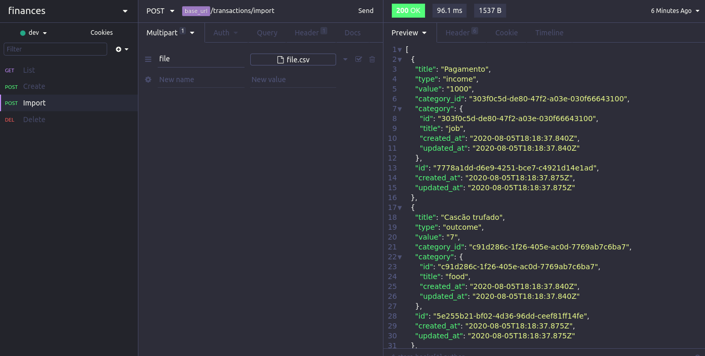
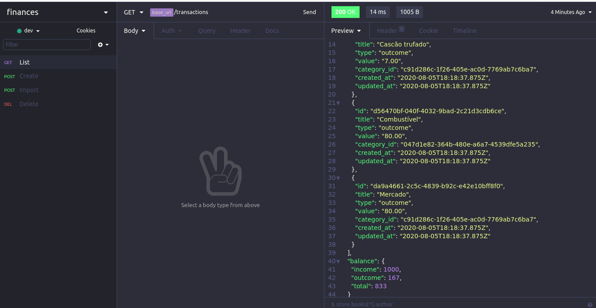
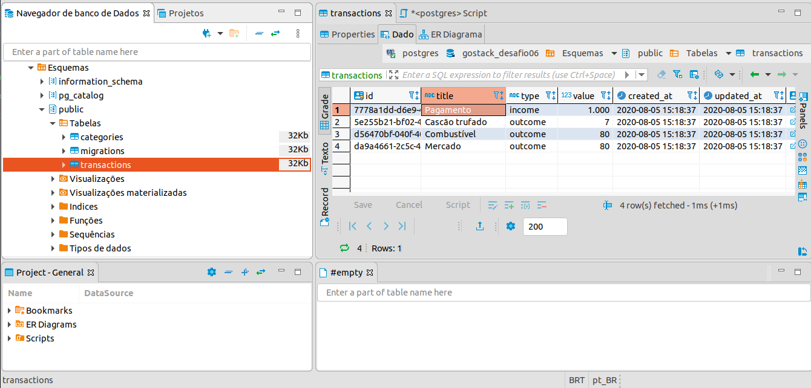

<p align="center">


</p>
<!-- <h1 align="center">

</h1> -->

<h4 align="center">
💳 Finances - Challenge finished 🚀 💳
</h4>

<p align="center">
<a href="#-sobre-o-projeto">Sobre</a> •
<a href="#-funcionalidades">Funcionalidades</a> •
<!-- <a href="#-layout">Layout</a> • -->
<a href="#-como-executar-o-projeto">Como executar</a> •
<a href="#-tecnologias">Tecnologias</a> •
<a href="#user-content--licença">Licença</a>
</p>

## 💻 Sobre o projeto

💳 Finances - Cadastro de transações financeiras

Aplicação em Node.js que armazena transações financeiras de entrada e saída, permitindo o cadastro e a listagem dessas transações, além de permitir a criação de novos registros no banco de dados a partir do envio de um arquivo csv.

---

## ⚙️ Funcionalidades

*Rotas*
- [x] POST /transactions
- Rota recebe title, value, type e category, cadastrando-as incluindo os campos updated_at e created_at
- [x] GET /transactions
- Retorna uma lista com todas as transações cadastradas, com o valor das entradas, saídas e total de crédito
- [x] DELETE /transactions/:id
- Permite deletar uma transação pelo id
- [x] POST /transactions/import
- A rota deve permite a importação de um arquivo com formato .csv

---

<!-- ## 🎨 Layout -->

<!-- O layout da aplicação está disponível no Figma:

<a href="https://www.figma.com/file/HOCmxfrElzLpI75LdzFLia/Github-Explorer](https://www.figma.com/file/HOCmxfrElzLpI75LdzFLia/Github-Explorer">

</a> -->


### Formato do CSV

```bash
title, type, value, category
Pagamento, income, 1000, job
Cascão trufado, outcome, 7, food
Combustível, outcome, 80, transporte
Mercado, outcome, 80, food
```

### Insmonia

- POST /transactions/import


- Get /transactions


---

### Para rodar o insomnia em sua máquina:

<p align="center">
 <a href="https://insomnia.rest/run/?label=API%20financess&uri=https%3A%2F%2Fgithub.com%2Frafanp%2Ffinances-backend%2Fblob%2Fmaster%2FInsomnia_API_finances.json" target="_blank"></a>
</p>

---

### DBeaver



---

## 🚀 Como executar o projeto

### Pré-requisitos

- Node.js +12.8.3
- Git
- Postgres
- Docker

#### 🎲 Rodando o projeto

```bash

# Clone este repositório
$ git clone https://github.com/rafanp/finances-backend

# Instale as dependências
$ yarn

# Para iniciar o servidor, acesse a pasta raiz do backend
$ yarn dev:server

# O servidor inciará na porta:3000 - utilize http://localhost:3000

```
---

## 🛠 Tecnologias

As seguintes ferramentas foram usadas na construção do projeto:

#### **Backend** ([Node.js](https://nodejs.org) + [TypeScript](https://www.typescriptlang.org/))

---

## 📝 Licença

Este projeto esta sobe a licença [MIT](./LICENSE).

Feito com ❤️ por Rafael Neves [Entre em contato!](https://www.linkedin.com/in/rafaelnps/)

---

